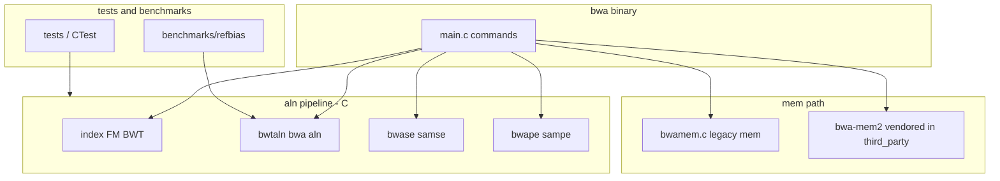

# bwa-neo — design

**Single working copy:** `~/Code/bwa-neo` as the opened workspace root. Agent handoff: `**AGENTS.md`**. Git practices: `**docs/DEVELOPMENT.md`**.

## Architecture (target)

## Components

| Component                      | Role                         | Notes                                                                                                                                                                                      |
| ------------------------------ | ---------------------------- | ------------------------------------------------------------------------------------------------------------------------------------------------------------------------------------------ |
| `libbwa` (static)              | FM-index, BWT, `bwamem`, I/O | Built from upstream `.c` list (see `Makefile` / `CMakeLists.txt`).                                                                                                                         |
| `bwa` executable               | CLI entrypoint               | `main.c` dispatches subcommands.                                                                                                                                                           |
| **Parallel `aln`**             | `bwa aln -t`                 | Already present in upstream (`bwtaln.c`); worker pool over reads.                                                                                                                          |
| **Parallel `samse` (pac_pos)** | `bwa samse -t`               | bwa-neo: pthreads split over sequences in `bwa_cal_pac_pos` (shared read-only `bwt_t`). Default `-t 1`.                                                                                    |
| **bwa-mem2**                   | `mem` algorithm              | Fetched into `third_party/bwa-mem2`; built with upstream Makefile or CMake `ExternalProject`. Full source merge of mem2 into a single `bwa` binary is phased (see `[tasks.md](tasks.md)`). |

## Data models (alignment)

- **Index**: prefix `.amb`, `.ann`, `.bwt`, `.pac`, `.sa` (classic BWA). bwa-mem2 uses a different index layout; do not mix without explicit conversion / documentation.
- **SAI**: binary record with `gap_opt_t` magic + per-read `bwt_aln1_t` lists.
- **SAM**: stdout; PG line includes version and CLI.

## Compatibility guarantees

- **SemVer** for bwa-neo releases (tag + changelog).
- **samse `-t`**: Same logical alignments as `-t 1` for a fixed index and input order; `drand48` ordering in `bwa_aln2seq` is unchanged before pac_pos.
- **mem / mem2**: SAM compatibility per bwa-mem2 project claims; verified by regression tests when enabled.

## Thread safety

- `bwa_cal_pac_pos` multi-threaded path: shared `bwt_t` is read-only; each thread owns disjoint `bwa_seq_t` indices.

## Licence

- This tree: see **`COPYING`** (GPLv3). File-level notices from upstream BWA and third parties must stay intact when merging code.
- bwa-mem2: MIT — see `third_party/bwa-mem2/LICENSE` after fetch.

